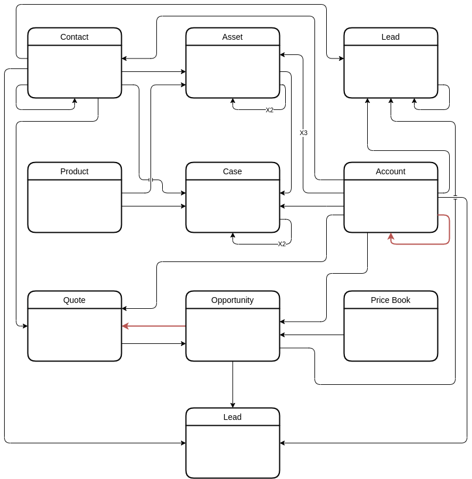
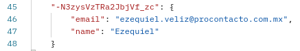
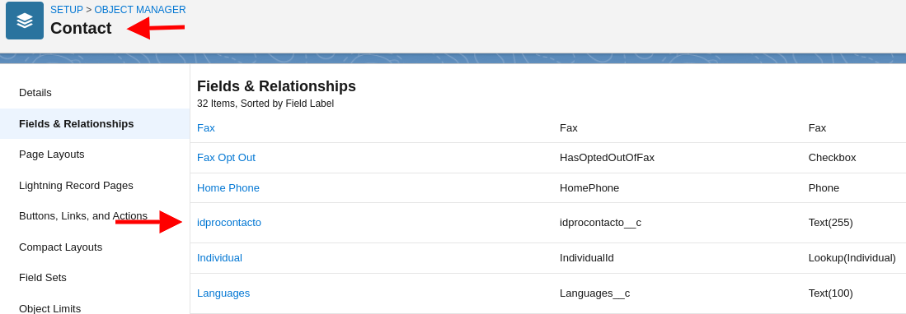

# procontacto-practica
Ejercicios de evaluación práctica para ProContacto

## Ejercicios

- [Ejercicio 2](#ejercicio-2)
- [Ejercicio 3](#ejercicio-3)
- [Ejercicio 4](#ejercicio-4)
- [Ejercicio 5](#ejercicio-5)
- [Ejercicio 6](#ejercicio-6)
- [Ejercicio 7](#ejercicio-7)

### Ejercicio 2
1. ¿Qué es un servidor HTTP?

   Un servidor HTTP es un componente de software que implementa el protocolo de transferencia HTTP, el mismo es una especie de contrato o interfaz que deben cumplir los distintos servicios web para poder comunicarse y entenderse entre ellos. Permite recibir y responder a distintas consultas hechas en el formato específico definido anteriormente. 
2. ¿Qué son los verbos HTTP? Mencionar los más conocidos
   
   Los verbos HTTP permiten definir distintas acciones a realizar sobre distintos recursos, como por ejemplo obtener los datos de una persona dado su ID, actualizar sus datos o eliminarla de un servicio.
   * GET: Obtiene el o los recursos pedidos, no debería generar efectos colaterales(actualización de datos o eliminaciones).
   * POST: Crea una nueva instancia del recurso dado con base en ciertos datos pasados por ejemplo en el body del request.
   * PUT: Permite actualizar los datos asociados a un recurso dado, se debe pasar el conjunto de datos completo asociado al mismo, ya que se persistirá lo que se reciba, si el recurso pasado no existía se creará uno nuevo.
   * PATCH: Permite actualizar los datos asociados a un recurso dado, a diferencia de PUT, no es necesario pasar todo el conjunto de datos, solo es necesario enviar los cambios.
   * DELETE: Elimina el recurso asociado a los datos pasados, por ejemplo, el ID del mismo.
3. ¿Qué es un request y un response en una comunicación HTTP? ¿Qué son los headers?

   En el contexto de una comunicación HTTP, un request es una solicitud hecha a un servidor, la misma puede utilizar cualquiera de los verbos descritos en el punto anterior, y la response es la respuesta originada por el servidor al request hecho anteriormente. Los headers son sencillamente un mecanismo que permite intercambiar información adicional entre el cliente y el servidor durante los requests y las responses.  
4. ¿Qué es un queryString? (En el contexto de una url)

   Un queryString es una manera de agregar datos en una URL, se escriben a continuación de un signo de pregunta(?) y se agregan de a pares clave/valor con un igual(=) entre ambos, si se quieren agregar multiples, se debe incrustar un ampersand(&) entre cada par clave/valor. 
5. ¿Qué es el responseCode? ¿Qué significado tiene los posibles valores devueltos?

   Un responseCode es un código que indica si un request dado se logró completar con éxito o no(y en este caso donde está el error), el mismo es parte de la response. Existen cinco tipos de responseCodes agrupados en las siguientes clases:
   * 100-199: Respuestas informativas
   * 200-299: Respuestas correctas
   * 300-399: Mensajes de redirección
   * 400-499: Errores en el cliente que produjo el request
   * 500-599: Errores en el servidor

   > Si se recibe un código que no pertenece a ninguna de estas cinco clases, el mismo no forma parte del standard y es propio del código del servidor. 
6. ¿Cómo se envía la data en un Get y cómo en un POST?
   
   En un GET, los datos viajan embebidos en la URL desde el cliente hacia el servidor, por ejemplo mediante un queryString, en el caso del POST, los mismos viajan en un campo del request llamado body, a diferencia de los requests GET, estos no pueden ser cacheados y no quedan en el historial del dispositivo.
7. ¿Qué verbo http utiliza el navegador cuando accedemos a una página?

   Al acceder a una página web, el navegador utiliza el verbo GET.
8. Explicar brevemente qué son las estructuras de datos JSON y XML dando ejemplo de estructuras posibles.

   Una estructura JSON es una estructura que sirve para el intercambio de datos, basada en un subset del lenguaje de programación JavaScript y formada básicamente por dos tipos de estructuras, siendo estas el array y pares clave/valor
```json
{
    "personas": [
       {
          "nombre": "Ezequiel",
          "edad": 27, 
          "mascotas": [
             {
                "animal": "gato"
             }
          ]
       },
       {
          "nombre": "Pepe",
          "edad": 30,
          "mascotas": []
       }
    ]
}
```
   Las estructuras XML buscan el mismo objetivo que las estructuras JSON, el intercambio de información, pero se construyen utilizando un lenguaje similar al HTML mediante etiquetas que se abren y cierran.
```xml 
<?xml version="1.0" encoding="UTF-8" ?>
<root>
  <personas>
    <nombre>Ezequiel</nombre>
    <edad>27</edad>
    <mascotas>
      <animal>gato</animal>
    </mascotas>
  </personas>
  <personas>
    <nombre>Pepe</nombre>
    <edad>30</edad>
    <mascotas/>
  </personas>
</root>
```
9. Explicar brevemente el estándar SOAP.

   SOAP significa "Simple Object Access Protocol" y define la estructura que debe tener el archivo XML que se utiliza para el intercambio de información o ejecución de procedimientos remotos entre dos servicios web. Cada uno de los intercambios se realiza utilizando mensajes SOAP, los cuales son archivos XML con la siguiente arquitectura:
   1. Deben poseer una etiqueta raíz llamada envelope.
   2. Pueden poseer una etiqueta opcional dentro de la anterior llamada header, la cual posee atributos que le indican al receptor como procesar el mensaje.
   3. Deben poseer una etiqueta llamada body, a continuación del header si es que existe, en la cual se encuentra la información a solicitar o la respuesta a la información solicitada
   4. Finalmente, es posible colocar una etiqueta llamada fault dentro del body obligatorio para indicar mensajes y códigos de error en caso de que ocurrieran durante el procesamiento de la solicitud
   
   Al haber un protocolo predefinido entre cliente y servidor, ambos quedan altamente acoplados, por lo que un cambio en cualquiera de los dos lados hará que la comunicación falle si no se sigue desde ambos lados.
10. Explicar brevemente el estándar REST Full

   REST significa "Representational State Transfer", a diferencia del protocolo SOAP, este es un estilo arquitectónico que define una manera standard de exponer los distintos componentes del sistema utilizando un recurso codificado mediante una URL al que puede acceder por ejemplo utilizando los verbos proveídos por el standard HTTP, no debe manejar estado y debe permitir el cacheo de las distintas responses. Continuando con las diferencias, este no restringe el tipo de datos que se puede transmitir, siendo estos, JSON, XML, imágenes, videos, documentos, etc.  
11. ¿Qué son los headers en un request? ¿Para qué se utiliza el key Content-type en un header?

   Los headers son un mecanismo para enviar información del cliente al servidor en los requests y del servidor al cliente en las responses. Se forman utilizando un par clave/valor con dos puntos(:) entre ellos. El key Content-Type se utiliza para indicar el tipo de datos a recibir/enviar dependiendo de si se trata de un response o request, en el caso del primero indica por ejemplo el formato de video durante una descarga, en el caso de un request indica el tipo de dato enviado, por ejemplo un documento json.

[← Volver](#ejercicios)
### Ejercicio 3
1. Realizar un request GET a la siguiente [URL](https://procontacto-reclutamiento-default-rtdb.firebaseio.com/contacts.json)


2. Realizar un request POST a la URL anterior con el siguiente body:
```json
{
    "name": "Ezequiel",
    "email": "ezequiel.veliz@procontacto.com.mx"
}
```


3. Realizar nuevamente un request GET a la [URL](https://procontacto-reclutamiento-default-rtdb.firebaseio.com/contacts.json)


4. ¿Qué diferencias se observan entre 1 y 3?
 
    Como se puede observar, al realizar el segundo request GET, el mismo retorna además del contenido original, el contenido del body del request POST del segundo paso.   

[← Volver](#ejercicios)
### Ejercicio 4

URL del perfil de Trailhead: [https://trailblazer.me/id/ezeveliz](https://trailblazer.me/id/ezeveliz)

[← Volver](#ejercicios)
### Ejercicio 5

1. Lead

   Un objeto Lead representa una posibilidad, por ejemplo un posible contacto, una posible cuenta, una posible oportunidad de venta.
   
   Utilizando el Schema Builder no se visualizan, pero en la documentación indica que este objeto posee tres relaciones Lookup con los objetos Account, Contact y Opportunity, estos campos se setean una vez que el objeto Lead haya sido convertido.
   * Campos: ActionCadenceAssigneeId, ActionCadenceId, ActivityMetricId, Address, AnnualRevenue, City, CleanStatus, Company, CompanyDunsNumber, ConnectionReceivedId, ConnectionSentId, ConvertedAccountId, ConvertedContactId, ConvertedDate, ConvertedOpportunityId, Country, CountryCode, CurrencyIsoCode, Description, Division, Email, EmailBouncedDate, EmailBouncedReason, Fax, FirstCallDateTime, FirstEmailDateTime, FirstName, HasOptedOutOfEmail, HasOptedOutOfFax, GeocodeAccuracy, IndividualId, Industry, IsConverted, IsDeleted, IsUnreadByOwner, Jigsaw, LastActivityDate, LastName, LastReferencedDate, LastViewedDate, LeadSource, MasterRecordId, MiddleName, MobilePhone, Name, NumberOfEmployees, OwnerId, PartnerAccountId, Phone, PhotoUrl, PostalCode, Rating, RecordTypeId, Salutation, ScoreIntelligenceId, State, StateCode, Status, Street, Suffix, Title y Website.
2. Account

   El objeto Account representa una cuenta en el negocio, la misma puede ser una organización o una persona relacionada con el mismo, como por ejemplo clientes, competidores y compañeros.
   
   Posee una única relación, y la misma es una relación Master-Detail contra sí mismo para indicar jerarquía entre diferentes cuentas, luego, existen múltiples relaciones Lookup pero todas son desde otros objetos a este, como por ejemplo de Contact, Quote, Opportunity, etc.
   * Campos: AccountNumber, AccountSource, AnnualRevenue, BillingAddress, BillingCity, BillingCountry, BillingCountryCode, BillingGeocodeAccuracy, BillingPostalCode, BillingState, BillingStateCode, BillingStreet, ChannelProgramName, ChannelProgramLevelName, CleanStatus, ConnectionReceivedId, ConnectionSentId, Description, DunsNumber, Fax, HasOptedOutOfEmail, IsCustomerPortal, IsDeleted, IsPartner, IsPersonAccount, Jigsaw, LastActivityDate, LastReferencedDate, LastViewedDate, MasterRecordId, NaicsCode, NaicsDesc, Name, NumberOfEmployees, OperatingHoursId, OwnerId, Ownership, ParentId, PersonIndividualId, Phone, PhotoUrl, Rating, RecordTypeId, Salutation, ShippingAddress, ShippingCity, ShippingCountry, ShippingCountryCode, ShippingGeocodeAccuracy, ShippingPostalCode, ShippingState, ShippingStateCode, ShippingStreet, Sic, SicDesc, Site, TickerSymbol, Tradestyle, Type, Website, YearStarted, FirstName, LastName, MiddleName, PersonAssistantName, PersonAssistantPhone, PersonBirthDate, PersonContactId, PersonDepartment, PersonEmail, PersonEmailBouncedDate, PersonEmailBouncedReason, PersonHasOptedOutOfEmail, PersonHomePhone, PersonLeadSource, PersonMailingAddress, PersonMailingCity, PersonMailingGeocodeAccuracy, PersonMailingLatitude, PersonMailingLongitude, PersonMailingStreet, PersonMobilePhone, PersonOtherLatitude, PersonOtherLongitude, PersonOtherPhone, PersonOtherStreet, PersonTitle y Suffix.
3. Contact

   El objeto Contact representa una persona individual asociada a una cuenta(objeto Account)
   
   Este Objeto posee una relación consigo mismo para el caso en el que dos contactos hayan sido unidos(merge) y con la cuenta a la que pertenece, al mismo tiempo hay múltiples otros objetos que se relacionan con este como por ejemplo Quote, Lead o Asset.
   * Campos: AccountId, AssistantName, AssistantPhone, Birthdate, CanAllowPortalSelfReg, CleanStatus, ConnectionReceivedId, ConnectionSentId, Department, Description, DoNotCall, Email, EmailBouncedDate, EmailBouncedReason, Fax, FirstCallDateTime, FirstName, HasOptedOutOfEmail, HasOptedOutOfFax, HomePhone, IndividualId, IsDeleted, IsEmailBounced, IsPersonAccount, Jigsaw, LastActivityDate, LastName, LastReferencedDate, LastViewedDate, LeadSource, MailingAddress, MailingCity, MailingState, MailingCountry, MailingPostalCode, MailingStateCode, MailingCountryCode, MailingStreet, MailingGeocodeAccuracy, MasterRecordId, MiddleName, MobilePhone, Name, OtherAddress, OtherCity, OtherCountry, OtherPostalCode, OtherState, OtherCountryCode, OtherStateCode, OtherGeocodeAccuracy, OtherPhone, OtherStreet, OwnerId, Phone, PhotoUrl, RecordTypeId, ReportsToId, Salutation, Suffix y Title.
4. Opportunity

   El objeto Opportunity representa una venta, o una posible venta.
   
   Este objeto posee una relación Master-Detail con el objeto Quote, ya que en este están almacenados los posibles listados de productos a vender y posibles descuentos, Luego, también está relacionado con el Price Book porque del mismo se obtienen los precios de los artículos, también con Account para saber a quién le pertenece la oportunidad, con el Objeto Lead que origino la oportunidad. 
   * Campos: AccountId, AgeInDays, Amount, CampaignId, CloseDate, ConnectionReceivedId, ConnectionSentId, ContactId, ContractId, CurrencyIsoCode, Description, ExpectedRevenue, Fiscal, FiscalQuarter, FiscalYear, ForecastCategory, ForecastCategoryName, HasOpenActivity, HasOpportunityLineItem, HasOverdueTask, IqScore, IsClosed, IsDeleted, IsExcludedFromTerritory2Filter, IsPriorityRecord, IsSplit, IsWon, LastActivityDate, LastActivityInDays, LastAmountChangedHistoryId, LastCloseDateChangedHistoryId, LastReferencedDate, LastStageChangeDate, LastStageChangeInDays, LastViewedDate, LeadSource, Name, NextStep, OwnerId, PartnerAccountId, Pricebook2Id, PricebookId, Probability, PushCount, RecordTypeId, StageName, SyncedQuoteID, Territory2Id, TotalOpportunityQuantity y Type.
5. Product

   El objeto Product representa un producto que vende la compañía.

   Este objeto no está relacionado con otros, sino que otros están relacionados con él, como por ejemplo Case y Asset. Se relaciona mediante una tabla intermedia con el objeto Price Book y con el objeto Opportunity.
   * Campos: BillingPolicyId, CanUseQuantitySchedule, CanUseRevenueSchedule, ConnectionReceivedId, ConnectionSentId, CurrencyIsoCode, Description, DisplayUrl, ExternalDataSourceId, ExternalId, Family, IsActive, IsArchived, IsDeleted, LastReferencedDate, LastViewedDate, Name, NumberOfQuantityInstallments, NumberOfRevenueInstallments, ProductClass, ProductCode, QuantityInstallmentPeriod, QuantityScheduleType, QuantityUnitOfMeasure, RecalculateTotalPrice, RevenueInstallmentPeriod, RevenueScheduleType, StockKeepingUnit, Type y TaxPolicyId.
6. Price Book

   El objeto Price Book representa una lista de precios de los distintos productos que vende la organización, pueden existir diferentes dedicadas a diferentes propósitos, como por ejemplo dedicadas a distintos canales de venta, mercados, con distintos descuentos, etc. La entrada de cada lista de precios se encuentra almacenada en el objeto Price Book Entry.
   
   Está relacionado con el objeto: Opportunity.
   * Campos: Description, IsActive, IsArchived, IsDeleted, IsStandard, LastReferencedDate, LastViewedDate, Name, ValidFrom y ValidTo.
7. Quote

   El objeto Quote hace de detail en una relación Master-Detail con el objeto Opportunity, el mismo es una colección de productos o servicios, con los precios propuestos, posibles descuentos, subtotales y totales, se pueden crear desde el objeto Opportunity y luego ser enviados como PDF al potencial cliente.

   Está relacionado con los objetos: Account, Contact, Opportunity, Pricebook.
   * Campos: AccountId, AdditionalAddress, AdditionalCity, AdditionalCountry, AdditionalCountryCode, AdditionalLatitude, AdditionalLongitude, AdditionalName, AdditionalPostalCode, AdditionalState, AdditionalStateCode, AdditionalStreet, BillingAddress, BillingCity, BillingCountry, BillingCountryCode, BillingLatitude, BillingLongitude, BillingName, BillingPostalCode, BillingState, BillingStateCode, BillingStreet, CalculationStatus, CanCreateQuoteLineItems, ContactId, ContractId, CurrencyIsoCode, Description, Discount, Email, ExpirationDate, Fax, IsSyncing, LastReferencedDate, LastViewedDate, LineItemCount, Name, OpportunityId, Phone, Pricebook2Id, QuoteNumber, QuoteToAddress, QuoteToCity, QuoteToCountry, QuoteToLatitude, QuoteToLongitude, QuoteToName, QuoteToPostalCode, QuoteToState, QuoteToStreet, RecordTypeID, ShippingAddress, ShippingCity, ShippingCountry, ShippingCountryCode, ShippingHandling, ShippingLatitude, ShippingLongitude, ShippingName, ShippingPostalCode, ShippingState, ShippingStateCode, ShippingStreet, Status, Subtotal, Tax, TotalPrice, TotalPriceWithTax y TotalTaxAmount. 
8. Asset

   El objeto Asset representa un artículo de valor comercial como por ejemplo un producto vendido por la compañía o un competidor, que un cliente compró. Poseen número de serie, fecha de compra y otros datos relacionados con la venta individual. Se pueden crear árboles de jerarquía para representar assets compuestos por otros assets.

   Está relacionado con los objetos: Account, Contact, Asset(en caso de assets compuestos existen 2 referencias, una apunta a su padre directo y la otra apunta al asset que representa la raíz del árbol).
   * Campos: AccountId, AssetLevel, AssetProvidedById, AssetServicedById, Availability, AverageUptimePerDay, ConsequenceOfFailure, ContactId, CurrentAmount, CurrentLifecycleEndDate, CurrentMrr, CurrentQuantity, Description, DigitalAssetStatus, ExternalIdentifier, HasLifecycleManagement, InstallDate, IsCompetitorProduct, IsInternal, LastReferencedDate, LastViewedDate, LifecycleEndDate, LifecycleStartDate, LocationId, ManufactureDate, Name, OwnerId, ParentId, Price, Product2Id, ProductCode, ProductDescription, ProductFamily, PurchaseDate, Quantity, Reliability, RenewalTerm, RenewalTermUnit, RootAssetId, SerialNumber, Status, StatusReason, StockKeepingUnit, SumDowntime, SumUnplannedDowntime, TotalLifecycleAmount, UptimeRecordEnd, UptimeRecordStart, UsageEndDate y Uuid.

9. Case

    El objeto Case representa algún problema, pregunta o retroalimentación(o comentario) y sus datos asociados como puede ser el tiempo que tarda en resolverse, comentarios, la cuenta relacionada que lo originó, el encargado del mismo, las actividades necesarias para solucionarlo o los métodos de contacto con el que lo originó.

    Está relacionado con los objetos: Account, Contact, Case(para el caso en que se unan(merge) dos cases diferentes o en el caso de que uno esté relacionado con otro)
     * Campos: AccountId, BusinessHoursId, Comments, CaseNumber, ClosedDate, CommunityId, ConnectionReceivedId, ConnectionSentId, ContactEmail, ContactFax, ContactId, ContactMobile, ContactPhone, CreatorFullPhotoUrl, CreatorName, CreatorSmallPhotoUrl, Description, FeedItemId, HasCommentsUnreadByOwner, HasSelfServiceComments, IsClosed, IsClosedOnCreate, IsDeleted, IsEscalated, IsSelfServiceClosed, IsStopped, IsVisibleInSelfService, Language, LastReferencedDate, LastViewedDate, MasterRecordId, Origin, OwnerId, ParentId, Priority, QuestionId, Reason, RecordTypeId, SlaStartDate, SourceId, Status, StopStartDate, Subject, SuppliedCompany, SuppliedEmail, SuppliedName, SuppliedPhone y Type.

10. Article

    Con respecto a este objeto, encontré referencias al mismo hasta la API versión 44.0(a partir de la misma se encuentra como "Salesforce Knowledge Objects") y no sería un objeto único, sino un conjunto de objetos(donde el objeto principal es KnowledgeArticle y se relaciona a través de una tabla intermedia llamada CaseArticle con el objeto Case) para representar información sobre los productos y servicios de la compañía y hacerlos disponibles en una base de conocimientos(KB). 
   
    Permite versionar la información disponible en los mismos, categorizarla según el tema al que hace referencia, asignarla a distintos canales(clientes, KB pública, etc.) y utilizar un ciclo de publicación con distintos estados, como por ejemplo Draft para indicar que aún está en construcción, Online para indicar que está publicado y Archived cuando su contenido ya no aplica. 



> Notas:
>  * El diagrama fue realizado utilizando tanto el Schema Builder del Playground como la documentación de referencia de los objetos standard de la API versión 55.0.
>  * Las relaciones que poseen una leyenda del estilo "XN" indican que poseen N relaciones en el mismo sentido de un objeto dado a otro, como por ejemplo entre Account y Asset. 
>  * El objeto Quote no se encontraba por default en el Schema Builder, tuve que activarlo desde el Setup del Playground.
>  * La flecha de color rojo entre Account y Account, y entre Opportunity y Quote, representa una relación Master-Detail, el resto son relaciones Lookup.

[← Volver](#ejercicios)
### Ejercicio 6

#### Soluciones de Salesforce
1. ¿Qué es Salesforce?
   
   Salesforce es una plataforma que provee un conjunto de servicios para diseñar y distribuir software adaptado a cada requerimiento entre los cuales se incluyen:
   * Módulos para administrar y gestionar las relaciones con los clientes y las ventas
   * Módulos para administrar el marketing de la empresa
   * Módulos de Business Intelligence
   * Módulos para el trabajo con IoT
   * etc.
2. ¿Qué es Sales Cloud?

   Sales Cloud es una plataforma CRM que permite gestionar las relaciones con el cliente, las ventas y el marketing.
3. ¿Qué es Service Cloud?

   Service Cloud es una plataforma para gestionar los sistemas de servicio al cliente y los equipos de soporte
4. ¿Qué es Health Cloud?

   Health Cloud es otro CRM, pero orientado a instituciones médicas, por lo que permite administrar las relaciones entre doctor y paciente, historiales médicos, etc.
5. ¿Qué es Marketing Cloud?

   Marketing cloud permite administrar todos los canales de marketing desde un único punto, ya sea web, mobil, email, redes sociales. Permite crear y administrar contenido para luego medir su impacto utilizando data analytics. 
#### Funcionalidades de Salesforce
1. ¿Qué es un RecordType?

   Un RecordType es metadata sobre el tipo de un record, te permite ofrecer distintos procesos, valores de listas desplegables y vistas de páginas según el tipo de usuario que los esté visualizando.
2. ¿Qué es un ReportType?

   Un ReportType es un tipo de reporte en el que se puede configurar que información se quiere visualizar sobre un objeto dado, con la posibilidad de agregar sus objetos relacionados bajo ciertas condiciones configurables.
3. ¿Qué es un Page Layout?

   El Page Layout es el diseño de una página dada, en él se puede configurar como se ven los records, los diferentes campos, visibles o no, obligatorios o no, los botones. 
4. ¿Qué es un Compact Layout?

   Un Compact layout es una manera de visualizar los campos claves de un record dado en una vista más compacta, por ejemplo para los dispositivos móviles.
5. ¿Qué es un Perfil?

   Un Perfil es una colección de configuraciones que definen lo que un usuario dado puede hacer en la plataforma.
6. ¿Qué es un Rol?

   Un Rol controla el nivel de visibilidad que tiene un usuario sobre los datos de un objeto en la plataforma.
7. ¿Qué es un Validation Rule?

   Una Validation Rule es una regla que puede contener fórmulas o expresiones que evalúan los datos ingresados en el campo de un objeto dado y retornan verdadero o false según la validez de los mismos. 
8. ¿Qué diferencia hay entre una relación Master Detail y Lookup?

   La diferencia es que la relación Master-Detail es estricta, por consiguiente, si se elimina al Master de la relación, también se eliminan todos los objetos Detail, ya que su existencia no tienen sentido. En el caso de Lookup, ambos pueden existir sin necesidad del otro.
9. ¿Qué es un Sandbox?

   Un Sandbox es un ambiente de desarrollo independiente del de producción que permite probar nuevas configuraciones, código o automatizaciones sin afectar los datos en producción.
10. ¿Qué es un ChangeSet?

    Un ChangeSet es un objeto que contiene información y permite enviar los cambios realizados en un Sandbox al ambiente de producción, solo permite enviar modificaciones realizadas a través de menu Setup de la organización, no records nuevos.
11. ¿Para qué sirve el import Wizard de Salesforce?

    El import Wizard se utiliza para importar datos externos a la organización y asignárselos tanto a los objetos standard como a los custom, se puede importar hasta un límite de 50.000 records a la vez.
12. ¿Para qué sirve la funcionalidad Web to Lead?

    La funcionalidad Web to Lead sirve para transformar a los visitantes de los sitios webs en posibles Leads, o sea, posibles clientes, ventas o cuentas nuevas. 
13. ¿Para qué sirve la funcionalidad Web to Case?

    La funcionalidad Web to Case permite iniciar Cases(ver ejercicio 5) desde la web recogiendo información suministrada por los clientes mismos.
14. ¿Para qué sirve la funcionalidad Omnichannel?

    La funcionalidad Omnichannel permite al servicio al cliente mantener una interacción con el cliente desde un mismo lugar sin importar el método preferido de contacto por el mismo, ya sea mail, SMS, llamadas, etc. 
15. ¿Para qué sirve la funcionalidad Chatter?
   
    La funcionalidad Chatter es una herramienta colaborativa integrada en salesforce que permite por ejemplo, realizar comentarios, subir archivos, publicar encuestas, publicar estados, etc. en una especie de feed sobre un record de un objeto dado. 

#### Conceptos Generales
1. ¿Qué significa SaaS?

   SaaS es un software(o aplicación final, por ejemplo Spotify) basado en la web que se ofrece como servicio por el que hay que pagar cada ciertos periodos regulares, pero ofrece la ventaja de que no hay que ocuparse del mantenimiento del mismo ni de la infraestructura que lo soporta.   
2. ¿Salesforce es Saas?

   Salesforce estaría más alineado dentro de la categoría de PaaS, ya que ofrece un servicio, pero el mismo no es final, porque uno lo debe adaptar a las necesidades, funcionalidades e identidad del negocio.
3. ¿Qué significa que una solución sea Cloud?

   El hecho de que una solución sea Cloud solo implica que la misma se ejecuta en uno o varios servidores ajenos a la empresa, existen soluciones tanto públicas como privadas(e hibridas), en las primeras diferentes aplicaciones de diferentes clientes corren en distintos entornos virtualizados en un mismo grupo de servidores, en la segunda alternativa todo un grupo de servidores es asignado al mismo cliente lo cual permite un mejor y más sencillo control.  
4. ¿Qué significa que una solución sea On-Premise?

   Para que una solución sea considerada On-Premise, la misma se debe ejecutar en servidores propios de la empresa y que funcionan dentro de los límites físicos de la misma. 
5. ¿Qué es un pipeline de ventas?

   Un pipeline de ventas es una representación gráfica en forma de proceso lineal de lo que debe hacer un representante de ventas para completar una operación.
6. ¿Qué es un funnel de ventas?

   Un funnel de ventas es el conjunto de pasos que una persona debe recorrer para convertirse finalmente en cliente.
7. ¿Qué significa Customer Experience?

   Customer Experience es el resultado de todas las interacciones entre el negocio y el cliente, dentro de las interacciones entra la navegación web, la charla con el servicio al cliente, la entrega del producto en tiempo y forma, el servicio post-venta, etc.
8. ¿Qué significa omnicanalidad?

   Omnicanalidad significa llegar a los clientes desde todos los medios de comunicación posibles para uqe la comunicación entre ambos puntos sea lo más orgánica y sencilla posible.
9. ¿Qué significa que un negocio sea B2B?¿Qué significa que un negocio sea B2C?¿Qué es un KPI?

   Un negocio B2B es un negocio cuyos clientes no son personas físicas finales, sino otros negocios, como por ejemplo la relación entre un productor y un distribuidor. Un negocio B2C es un negocio que a diferencia del anterior, sus clientes son personas físicas finales.
   
   Un KPI es una métrica/medida del nivel del rendimiento de un proceso. El valor del indicador está directamente relacionado con un objetivo fijado previamente y normalmente se expresa en valores porcentuales
10. ¿Qué es una API y en qué se diferencia de una Rest API?

    Una API es sencillamente una interfaz que sirve para exponer las funcionalidades y la manera en como interactuar con un servicio web dado. En cambio, una API REST es una API, pero que sigue los lineamientos de diseño establecidos por REST. 
11. ¿Qué es un Proceso Batch?

    Un proceso Batch es un proceso que corre asincrónicamente o sin intervención del usuario, también puede ocurrir cada ciertos intervalos de tiempo predefinidos. Se utiliza para ejecutar tareas repetitivas y que pueden llegar a conllevar una carga sobre el sistema que si se efectuara sincrónicamente podría llegar a enlentecer el sistema. 
12. ¿Qué es Kanban?

    Kanban es una metodología para administrar el desarrollo de procesos utilizando una tabla con varias columnas entre las que se pueden encontrar la lista de tareas pendientes(o To Do), la lista de tareas en progreso(o In Progress) y la lista de tareas terminadas(o Done). Al comienzo del ciclo de desarrollo se define el backlog de tareas a realizar y se agregan a la columna de To Do, a medida que se comience a trabajar en las mismas se mueven a la columna de In Progress, y finalmente cuando son concluidas se mueven a la columna de Done.
13. ¿Qué es un ERP?
   
    ERP es una herramienta integrada para administrar los procesos de las distintas áreas del negocio, ya sea finanzas, contabilidad, producción, abastecimiento, etc.
14. ¿Salesforce es un ERP?

    Salesforce es un CRM, pero no puede considerarse un ERP porque le faltan herramientas necesarias para la administración de finanzas, abastecimiento y producción entre otras.

[← Volver](#ejercicios)
### Ejercicio 7

1. Consultar el ID haciendo un GET al Web Service del ejercicio 3
   
2. Agregar un campo idprocontacto al objeto Contact
   
3. Código de la solución

Trigger
```apex
trigger PopulateContactsEmailTrigger on Contact (before insert, before update) {

    if ((Trigger.isBefore && Trigger.isInsert) || 
        (Trigger.isBefore && Trigger.isUpdate)) {
            
            List<Contact> toUpdate = new List<Contact>();
            
            for (Contact contact : Trigger.new) {
                
                // Valido que exista el campo idprocontacto__c, caso contrario no podré hallar el email correspondiente
                if (contact.idprocontacto__c == null || contact.idprocontacto__c.length() == 0) {
                    
                    continue;
                }
                
                toUpdate.add(contact);
            }
            
            // Inicio un trabajo encolable para actualizar los emails asincrónicamente
            System.enqueueJob(new ContactEmailUpdater(toUpdate));
        }
        
}
```

Callout
```apex
public class ContactsCallout {

    public static String getEmail(String idprocontacto) {
        
        // Intento obtener el email correspondiente al ID del contacto
        Http http = new Http();
        HttpRequest request = new HttpRequest();
        request.setEndpoint('https://procontacto-reclutamiento-default-rtdb.firebaseio.com/contacts/' + idprocontacto + '.json');
        request.setMethod('GET');
        HttpResponse response = http.send(request);
        
        // Obtuve una respuesta correcta, ante cualquier error retorna un string vacío
        if(response.getStatusCode() == 200) {
            
            Map<String, Object> results = (Map<String, Object>) JSON.deserializeUntyped(response.getBody());
            
            // El ID no existía
            if (results == null) {
                
                return '';
            }
            
            return (String) results.get('email');
        }
        return '';
    }
}
```

Async Job
```apex
/**
 * Clase asincronica para actualizar los emails
 */ 
public class ContactEmailUpdater implements Queueable, Database.AllowsCallouts {
    
    private List<Contact> contacts;

    public ContactEmailUpdater(List<Contact> myContacts) {
        contacts = myContacts;
    }
    
    public void execute(QueueableContext context) {
        
        // Lista de contactos para actualizar en batch
        List<Contact> toUpdate = new List<Contact>();
        
        // Itero la lista de contactos buscando los emails correspondientes
        for (Contact con: contacts) {
            
            // Obtengo el email correspondiente al id de procontacto
            String email = ContactsCallout.getEmail(con.idprocontacto__c);
            
            /**
             * Si no poseia email, y se pudo obtener un email correspondiente 
             * al ID dado, lo agrego a la lista para actualizar
             */  
            if (con.Email == null && email.length() > 0) {
                
                con.Email = email;
                toUpdate.add(con);
                continue;
            }
            
            /**
             * Si el contacto ya poseía un email y se pudo encontrar un email 
             * correspondiente al ID dado, valido que los dos emails disponibles 
             * no sean iguales ya que si no lo hago y actualizo igualmente, se 
             * genera una cadena infinta de procesos encolables
             */ 
            if (con.Email != null && con.Email.length() > 0 && 
                email.length() > 0 && !con.Email.equals(email)) {
                
                con.Email = email;
                toUpdate.add(con);
            }
            
        }
        
        // Si habia algo para actualizar, actualizo
        if (toUpdate.size() > 0) {
            
            update toUpdate;
        }
    }
}
```
[← Volver](#ejercicios)