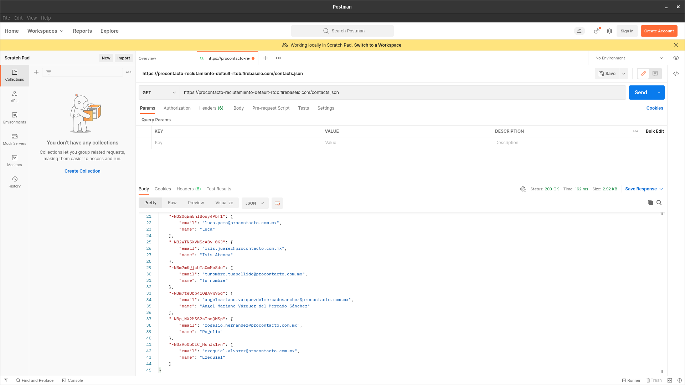

# procontacto-practica
Ejercicios de evaluación práctica para ProContacto

## Ejercicios

- [Ejercicio 2](#ejercicio-2)
- [Ejercicio 3](#ejercicio-3)
- [Ejercicio 4](#ejercicio-4)
- [Ejercicio 5](#ejercicio-5)
- [Ejercicio 6](#ejercicio-6)
- [Ejercicio 7](#ejercicio-7)

### Ejercicio 2
1. ¿Qué es un servidor HTTP?
2. ¿Qué son los verbos HTTP? Mencionar los más conocidos
3. ¿Qué es un request y un response en una comunicación HTTP? ¿Qué son los headers?
4. ¿Qué es un queryString? (En el contexto de una url)
5. ¿Qué es el responseCode? ¿Qué significado tiene los posibles valores devueltos?
6. ¿Cómo se envía la data en un Get y cómo en un POST?
7. ¿Qué verbo http utiliza el navegador cuando accedemos a una página?
8. Explicar brevemente qué son las estructuras de datos JSON y XML dando ejemplo de estructuras posibles.
9. Explicar brevemente el estándar SOAP.
10.	Explicar brevemente el estándar REST Full
11.	¿Qué son los headers en un request? ¿Para qué se utiliza el key Content-type en un header?

[← Volver](#ejercicios)
### Ejercicio 3
1. Realizar un request GET a la siguiente [URL](https://procontacto-reclutamiento-default-rtdb.firebaseio.com/contacts.json)



2. Realizar un request POST a la URL anterior con el siguiente body:
```json
{
    "name": "Ezequiel",
    "email": "ezequiel.veliz@procontacto.com.mx"
}
```


3. Realizar nuevamente un request GET a la [URL](https://procontacto-reclutamiento-default-rtdb.firebaseio.com/contacts.json)


4. ¿Qué diferencias se observan entre 1 y 3?
 
    Como se puede observar, al realizar el segundo request GET, el mismo retorna además del contenido original, el contenido del body del request POST del segundo paso.   

[← Volver](#ejercicios)
### Ejercicio 4

URL del perfil de Trailhead: [https://trailblazer.me/id/ezeveliz](https://trailblazer.me/id/ezeveliz)

[← Volver](#ejercicios)
### Ejercicio 5
[← Volver](#ejercicios)
### Ejercicio 6
[← Volver](#ejercicios)
### Ejercicio 7
[← Volver](#ejercicios)